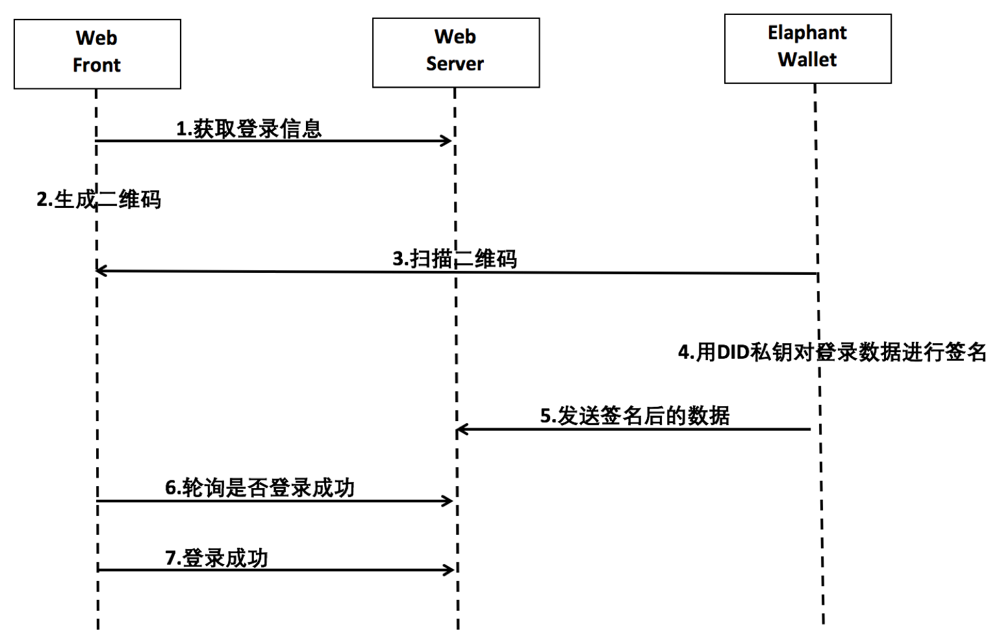

# ElephantWallet 协议文档 

版本：1.0

协议最后更新：2019.2.18

English Version: https://github.com/xuxinlai2002/ElephantWallet/blob/master/README_en.md （ XXXX 翻译）

## 简介
ElephantWallet是一个Elastos钱包和dapp的通用对接协议。

目前Elastos的钱包应用众多、dapp也在快速发展中，在实际对接过程中，各方标准不统一，对接耗时耗力。
遵照此协议，可以减少各方开发适配工作，低耦合的实现钱包对dapp进行登录授权和支付。
钱包接入方可在 https://www.XXXX.com 进行在线测试。 

## 协议发起方
本协议由宋世军起草，徐信来、XXX、YYY、ZZZ 共同参与讨论和修改。

目前接入此协议的名单：https://github.com/XXXX/ElephantWallet/blob/master/supporter_list.md

欢迎更多的钱包和dapp接入此协议，并向我们提交你们的产品信息。

## 功能列表
- 登录
1. 场景1：钱包App扫二维码进行登录，适用于WEB版的应用
2. 场景2：dapp的移动端APP拉起钱包APP，请求登录授权
3. 场景3：钱包APP内嵌dapp的H5页面，进行登录（暂无）

- 支付
1. 场景1：钱包扫码支付，适用于WEB版dapp
2. 场景2：dapp的移动端拉起钱包APP请求支付授权
3. 场景3：钱包APP内嵌dapp的H5页面，进行支付（暂无）

## 协议内容

### 1. 钱包APP在系统注册拦截协议

钱包APP应在操作系统内注册拦截协议（URL Scheme、appLink），以便dapp的APP拉起钱包应用。

以下为协议接入方法：

拦截协议为：elaphant://identity

dapp的移动端应用可以调用此协议，传递数据给钱包APP，传递数据的请求格式为：

elaphant://identity?{数据}

示例
```
elaphant://identity?
CallbackUrl=https%3A%2F%2Fredpacket.elastos.org%2Fpacket%2Fgrab%2F87 08636757758637-1%3F_locale%3Dzh_CN&
ReturnUrl=https%3A%2F%2Fredpa cket.elastos.org%2Fpacket%2Fgrabed%2F168-1-0%3F_locale%3Dzh_CN&
Description=redpacket&
AppID=cc053c61afc22dda9a309e96943c1734&
PublicKey=028971D6DA990971ABF7E8338FA1A81E1342D0E0FD8C4D2A4DF68F776CA66EA0B1&
Signature=90E8A60DC055C90F4765E91B6E4F07031F55CF7DD2DA4EF1EF55EA41D160CB48879F62D70EC8ED090E4CBBE013D21E7580C36CFA2173A997ADADB7255B23098F&
DID=ihKwfxiFpYme8mb11roShjjpZcHt1Ru5VB& RandomNumber=4B15688B2F24CD8DCDB6CCBC7E0311404F9CC89D65D7D009C918C046A6C475AB&
AppName=redpacket
```
### 2. 登录
 

#### 场景1：使用钱包扫码二维码登录
> 	适合dapp的网站接入。
> 
> 业务流程图如下：

<p align="center">
    
    <p align="center">
        <em>图片示例2</em>
    </p>
</p>


- dapp生成二维码，钱包扫描dapp web提供的登录二维码，此二维码的数据格式为json，包含以下数据：
```
// 登录的二维码数据格式
{
    protocol	string   // 协议名，钱包用来区分不同协议，本协议为 ElephantWallet
    version     string   // 协议版本信息，如1.0
    dappName    string   // dapp名字
    dappIcon    string   // dapp图标 
    action      string   // 赋值为login
    uuID        string   // dapp server生成的，用于此次登录验证的唯一标识   
    loginUrl    string   // dapp server上用于接受登录验证信息的url
    expired	number   // 二维码过期时间，unix时间戳
    loginMemo	string   // 登录备注信息，钱包用来展示，可选
}
```
- 钱包对登录相关数据进行签名
```
// 生成sign算法
let data = timestamp + account + uuID + ref     //ref为钱包名，标示来源
sign = ecc.sign(data, privateKey)
```
- 钱包将签名后的数据POST到dapp提供的loginUrl，请求登录验证
```
 // 请求登录验证的数据格式
{
    protocol   string     // 协议名，钱包用来区分不同协议，本协议为 ElephantWallet
    version    string     // 协议版本信息，如1.0
    timestamp  number     // 当前UNIX时间戳
    sign       string     // Elastos签名
    uuID       string     // dapp server生成的，用于此次登录验证的唯一标识     
    account    string     // Elastos账户名
    ref        string     // 来源,如钱包名
}
```
- dapp server收到数据，验证sign签名数据，并返回结果code；若验证成功，则在dapp的业务逻辑中，将该用户设为已登录状态
  
```
// 错误返回 
{
    code number     //错误符，等于0是成功，大于0说明请求失败，dapp返回具体的错误码
    error string    //返回的提示信息
}

```
#### 场景2：dapp的移动端应用拉起钱包App，请求登录授权
> 	适合dapp的移动端(iOS或安卓端）接入。业务流程图如下：


- dapp的移动端拉起钱包APP要求登录授权，并传递给钱包App如下的数据，数据格式为json：
```
// dapp传递给钱包APP的数据包结构
{
    protocol	string   // 协议名，钱包用来区分不同协议，本协议为 ElephantWallet
    version     string   // 协议版本信息，如1.0
    dappName    string   // dapp名字，用于在钱包APP中展示
    dappIcon    string   // dapp图标Url，用于在钱包APP中展示
    action      string   // 赋值为login
    uuID        string   // dapp生成的，用于dapp登录验证唯一标识   
    loginUrl    string   // dapp server生成的，用于接受此次登录验证的URL 
    loginMemo	string   // 登录的备注信息，钱包用来展示，可选
    callback    string   // 用户完成操作后，钱包回调拉起dapp移动端的回调URL,如appABC://abc.com?action=login，可选
    		         // 钱包回调时在此URL后加上操作结果(&result)，如：appABC://abc.com?action=login&result=1, 
			 // result的值为：0为用户取消，1为成功,  2为失败
}
```
- dapp server收到数据，验证sign签名数据，返回success == true或false；若验证成功，则在dapp的业务逻辑中，将该用户设为已登录状态

### 3. 支付
#### 场景1：钱包扫描二维码进行支付
> 业务流程图如下:


```
// dapp生成的用于钱包扫描的二维码数据格式
{
	protocol    string   // 协议名，钱包用来区分不同协议，本协议为 ElephantWallet
    	version     string   // 协议版本信息，如1.0
	dappName    string   // dapp名字，用于在钱包APP中展示，可选
    	dappIcon    string   // dapp图标Url，用于在钱包APP中展示，可选
	action      string   // 支付时，赋值为transfer，必须
	from        string   // 付款人的Elastos账号，可选
	to          string   // 收款人的Elastos账号，必须
	amount      number   // 转账数量，必须
	contract    string   // 转账的token所属的contract账号名，必须
	symbol      string   // 转账的token名称，必须
	precision   number   // 转账的token的精度，小数点后面的位数，必须
	dappData    string   // 由dapp生成的业务参数信息，需要钱包在转账时附加在memo中发出去，格式为:k1=v1&k2=v2，可选
			     // 钱包转账时还可附加ref参数标明来源，如：k1=v1&k2=v2&ref=walletname
	desc	    string   // 交易的说明信息，钱包在付款UI展示给用户，最长不要超过128个字节，可选			     
	expired	    number   // 二维码过期时间，unix时间戳
        callback    string   // 用户完成操作后，钱包回调拉起dapp移动端的回调URL,如https://abc.com?action=login&qrcID=123，可选
    		             // 钱包回调时在此URL后加上操作结果(result、txID)，如：https://abc.com?action=login&qrcID=123&result=1&txID=xxx, 
			     // result的值为：0为用户取消，1为成功,  2为失败；txID为Elastos主网上该笔交易的id（若有）
}
```
- 钱包组装上述数据，生成一笔Elastos的transaction，用户授权此笔转账后，提交转账数据到Elastos主网；若有callback参数，则进行回调访问
- dapp可根据callback中的txID去主网查询此笔交易（不能完全依赖此方式来确认用户的付款）；或dapp自行搭建节点监控Elastos主网，检查代币是否到账
- 对于流行币种如IQ，如果二维码中给出的contract名和官方的合约名不一致，钱包方要提醒用户，做二次确认
- 钱包应该提醒用户注意辨别二维码的来源，避免被钓鱼攻击


#### 场景2：dapp的移动端拉起钱包App，请求支付授权
> 业务流程图如下：


```
// 传递给钱包APP的数据包结构
{
	protocol    string   // 协议名，钱包用来区分不同协议，本协议为 ElephantWallet
	version     string   // 协议版本信息，如1.0
	action      string   // 支付时，赋值为transfer
	dappName    string   // dapp名字，用于在钱包APP中展示，可选
    	dappIcon    string   // dapp图标Url，用于在钱包APP中展示，可选	
	from        string   // 付款人的Elastos账号，可选
	to          string   // 收款人的Elastos账号，必须
	amount      number   // 转账数量，必须
	contract    string   // 转账的token所属的contract账号名	
	symbol      string   // 转账的token名称，必须
	precision   number   // 转账的token的精度，小数点后面的位数，必须	
	dappData    string   // 由dapp生成的业务参数信息，需要钱包在转账时附加在memo中发出去，格式为:k1=v1&k2=v2，可选
			     // 钱包转账时还可附加ref参数标明来源，如：k1=v1&k2=v2&ref=walletname
	desc	    string   // 交易的说明信息，钱包在付款UI展示给用户，最长不要超过128个字节，可选			     
        callback    string   // 用户完成操作后，钱包回调拉起dapp移动端的回调URL,如appABC://abc.com?action=login，可选
    		             // 钱包回调时在此URL后加上操作结果(result、txID)，如：appABC://abc.com?action=login&result=1&txID=xxx, 
			     // result的值为：0为用户取消，1为成功,  2为失败；txID为Elastos主网上该笔交易的id（若有）
}
```
- 钱包组装上述数据，生成一笔Elastos的transaction，用户授权此笔转账后，提交转账数据到Elastos主网；如果有callback，则回调拉起dapp的应用
- dapp可根据callback里的txID去主网查询此笔交易（不能完全依赖此方式来确认用户的付款）；或自行搭建节点监控Elastos主网，检查代币是否到账


### 错误处理
- code不等于0则请求失败
```
// 错误返回 
{
    code number     //错误符，等于0是成功，大于0说明请求失败，dapp返回具体的错误码
    error string    //返回的提示信息
}
```

## FAQ

* 如何避免用户扫描了伪造的二维码？

  > 虽然可以通过创建一个统一的dapp和钱包注册中心，通过白名单的方式来避免钓鱼，但这会使此协议更复杂、更中心化，从而也更脆弱。我们建议钱包商在界面上提醒用户注意识别二维码的来源，提高用户的安全意识，同时向用户展示签名的原始信息。

* 二维码的信息过多，可否增加压缩算法？

  > 我们进行过测试，能压缩20-30%左右，效果不算特别理想，因此协议中没有将压缩算法正式纳入。虽然二维码看起来过密，但钱包基本均可正常识别。我们建议，如果二维码信息过多，dapp在展示二维码的时候，适当加大尺寸，让用户不必将手机凑近屏幕，提高钱包的识别速度。

* 在验证登录信息的时候，dapp应该验证active还是owner的签名？

  > 我们建议dapp先验证active的签名，若不通过，再验证owner。对于钱包商来说，建议用active权限来签名。

* 对dapp内嵌到钱包里面的场景，ElephantWallet协议为何不制定相关登录和支付标准？

  > 目前多数钱包均在开发或已开发出自己的一套相关标准，统一标准的代价很大。我们建议各钱包商也参考scatter的方案来，这样会大大降低在web端已经接入了scatter的dapp们的适配成本。

* ElephantWallet协议为何不制定钱包和dapp之间的智能合约调用的标准？

  > 同上。


## 更新说明
- 9.6
  增加了FAQ内容
- 8.17 
  增加测试链接；
  支付操作中增加了callback参数；
  修改两个字段的命名，expire->expired,callbackUrl->callback
- 8.16 
  修改dapp的应用调用钱包APP时的callback，钱包只需要附加result结果即可，无需拼装action参数
- 8.15 
  简化协议，取消info字段；增加desc字段，此字段是string类型，用来描述一个交易
