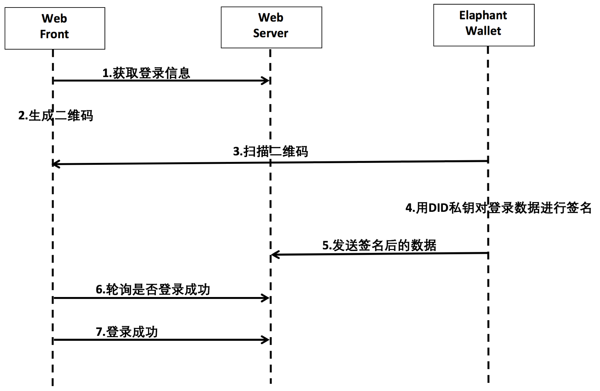

# ElephantWallet 协议文档 

版本：1.0

协议最后更新：2019.2.18

English Version: https://github.com/xuxinlai2002/ElephantWallet/blob/master/README_en.md （ XXXX 翻译）

## 简介
ElephantWallet是一个Elastos钱包和dapp的通用对接协议。

目前Elastos的钱包应用众多、dapp也在快速发展中，在实际对接过程中，各方标准不统一，对接耗时耗力。
遵照此协议，可以减少各方开发适配工作，低耦合的实现钱包对dapp进行登录授权和支付。
钱包接入方可在 https://www.XXXX.com 进行在线测试。 

## 协议发起方
本协议由宋世军起草，徐信来、XXX、YYY、ZZZ 共同参与讨论和修改。

目前接入此协议的名单：https://github.com/XXXX/ElephantWallet/blob/master/supporter_list.md

欢迎更多的钱包和dapp接入此协议，并向我们提交你们的产品信息。

## 功能列表
- 登录
1. 场景1：钱包App扫二维码进行登录，适用于WEB版的应用
2. 场景2：dapp的移动端APP拉起钱包APP，请求登录授权
3. 场景3：钱包APP内嵌dapp的H5页面，进行登录（暂无）

- 支付
1. 场景1：钱包扫码支付，适用于WEB版dapp
2. 场景2：dapp的移动端拉起钱包APP请求支付授权
3. 场景3：钱包APP内嵌dapp的H5页面，进行支付（暂无）

## 协议内容

### 1. 钱包APP在系统注册拦截协议

钱包APP应在操作系统内注册拦截协议（URL Scheme、appLink），以便dapp的APP拉起钱包应用。

以下为协议接入方法：

拦截协议为：elaphant://identity

dapp的移动端应用可以调用此协议，传递数据给钱包APP，传递数据的请求格式为：

elaphant://identity?{数据}

示例
```
elaphant://identity?
CallbackUrl=https%3A%2F%2Fredpacket.elastos.org%2Fpacket%2Fgrab%2F87 08636757758637-1%3F_locale%3Dzh_CN&
ReturnUrl=https%3A%2F%2Fredpa cket.elastos.org%2Fpacket%2Fgrabed%2F168-1-0%3F_locale%3Dzh_CN&
Description=redpacket&
AppID=cc053c61afc22dda9a309e96943c1734&
PublicKey=028971D6DA990971ABF7E8338FA1A81E1342D0E0FD8C4D2A4DF68F776CA66EA0B1&
Signature=90E8A60DC055C90F4765E91B6E4F07031F55CF7DD2DA4EF1EF55EA41D160CB48879F62D70EC8ED090E4CBBE013D21E7580C36CFA2173A997ADADB7255B23098F&
DID=ihKwfxiFpYme8mb11roShjjpZcHt1Ru5VB& RandomNumber=4B15688B2F24CD8DCDB6CCBC7E0311404F9CC89D65D7D009C918C046A6C475AB&
AppName=redpacket
```
### 2. 登录
 

#### 场景1：使用钱包扫码二维码登录
> 适合第三方网站接入。
> 
> 业务流程图如下：



- web前端生成二维码，钱包扫描web提供的登录二维码，此二维码的数据，包含以下数据：
```
// 1.登录的二维码数据内容
{
	CallbackUrl     	String  //授权请求地址
	ReturnUrl         	String  //授权成功后回调地址
	Description      	String  //描述
	AppID               	String  //平台授权AppID
	PublicKey         	String  //公钥
	Signature        	String  //签名
	DID                 	String  //平台DID
	RandomNumber  		int   	//随机数
	AppName          	String  //应用名称
}
```

- 钱包对登录相关数据进行签名
```
利用私钥对AppID加密，函数如下(IOS版): 
ElastosWalletKit.Sign(privateKey: elaPrivKey, data: testData!, len: testData.count, signedData: &signedData)

//传参
{
	privateKey  		String 	//ELA 私钥
	data  			data 	//待签名内容
	len  			int 	//待签名内容长度
	signedData 		data 	//签名输出
}
```

- 钱包将签名后的数据POST到dapp提供的CallbackUrl，请求登录验证
```
//1.生成请求登录验证的数据格式（最终将下面reqJson数据提交）
reqJsonData 数据如下：
{
	ELAAddress  		String  //ELA地址
 	NickName   		String  //昵称
}
         
//2.对请求登录验证的数据进行进行签名，发送的CallbackUrl 
reqJson 数据如下：        
{
    	Data       		string   // reqJsonData Json字符串
    	Sign    		string   // reqJsonData 数据进行钱包相关数据签名
    	PublicKey  		string   // 公钥
}
```
- 成功回调ReturnUrl
  

#### 场景2：dapp的移动端应用拉起钱包App，请求登录授权
> 适合dapp的移动端(iOS或安卓端）接入。业务流程图如下：


- dapp的移动端拉起钱包APP要求登录授权，并传递给钱包App如下的数据，数据格式为json：
```
// dapp传递给钱包APP的数据包结构
{   
    	CallbackUrl		String  //授权请求地址
    	ReturnUrl		String  //授权成功后回调地址
	Description		String  //备注描述
	AppID			String  //平台授权AppID
	PublicKey		String  //公钥
	Signature		String  //签名
	DID			String  //平台DID
	RandomNumber		int   	//随机数
	AppName			String  //应用名称
    		        
}
```
- 钱包对登录相关数据进行签名
```
利用私钥对AppID加密，函数如下(IOS版): 
ElastosWalletKit.Sign(privateKey: elaPrivKey, data: testData!, len: testData.count, signedData: &signedData)

//传参
{
	privateKey		String 	//ELA 私钥
	data  			data 	//待签名内容
	len  			int 	//待签名内容长度
	signedData 		data 	//签名输出

}
```

- 钱包将签名后的数据POST到dapp提供的CallbackUrl，请求登录验证
```
//1.生成请求登录验证的数据格式（最终将下面reqJson数据提交）
reqJsonData 数据如下：
{
	ELAAddress  		String  //ELA地址
 	NickName   		String  //昵称
}
         
//2.对请求登录验证的数据进行进行签名，发送的CallbackUrl 
reqJson 数据如下：        
{
    	Data       		string   // reqJsonData Json字符串
    	Sign    		string   // reqJsonData 数据进行钱包相关数据签名
    	PublicKey  		string   // 公钥
}
```

- dapp server收到数据，验证sign签名数据，返回success == true或false；若验证成功，则在dapp的业务逻辑中，将该用户设为已登录状态

### 3. 支付
#### 场景1：钱包扫描二维码进行支付
> 业务流程图如下:


```
// dapp生成的用于钱包扫描的二维码数据格式
{
	CallbackUrl		String  //回调地址
	Description		String  //描述
	AppID			String  //平台授权AppID
	PublicKey		String  //公钥
	Signature		String  //签名
	Serialnumber		int     //序号    
	DID			String  //平台DID
	RandomNumber		int   	//随机数
	Name			String  //应用名称
	CoinName		String 	//币种类
	Amount			int  	//币数量
	PaymentAddress		String 	//付款地址
}
```
- 钱包对支付相关数据进行签名
```
利用私钥对AppID加密，函数如下(IOS版): 
ElastosWalletKit.Sign(privateKey: elaPrivKey, data: testData!, len: testData.count, signedData: &signedData)

//传参
{
	privateKey  		String 	//ELA 私钥
	data  			data 	//待签名内容
	len  			int 	//待签名内容
	signedData 		data 	//签名输出
}
```
- 钱包组装上述数据，生成一笔Elastos的transaction，用户授权此笔转账后，提交转账数据到Elastos主网；若有callback参数，则进行回调访问
- dapp可根据callback中的txID去主网查询此笔交易（不能完全依赖此方式来确认用户的付款）；或dapp自行搭建节点监控Elastos主网，检查代币是否到账
- 钱包应该提醒用户注意辨别二维码的来源，避免被钓鱼攻击


#### 场景2：dapp的移动端拉起钱包App，请求支付授权
> 业务流程图如下：


```
// 传递给钱包APP的数据包结构
{
	CallbackUrl		String  //回调地址
	Description		String  //描述
	AppID			String  //平台授权AppID
	PublicKey		String  //公钥
	Signature		String  //签名
	Serialnumber		int     //序号
	DID			String  //平台DID
	RandomNumber		int   	//随机数
	Name			String  //应用名称
	CoinName		String 	//币种类
	Amount			int  	//币数量
	PaymentAddress		String 	//付款地址
}
```
- 钱包对支付相关数据进行签名
```
利用私钥对AppID加密，函数如下(IOS版): 
ElastosWalletKit.Sign(privateKey: elaPrivKey, data: testData!, len: testData.count, signedData: &signedData)

//传参
{
	privateKey  		String 	//ELA 私钥
	data  			data 	//密文内容
	len  			int 	//密文内容长度
	signedData 		data 	//输出密文
}
```
- 钱包组装上述数据，生成一笔Elastos的transaction，用户授权此笔转账后，提交转账数据到Elastos主网；如果有callback，则回调拉起dapp的应用
- dapp可根据callback里的txID去主网查询此笔交易（不能完全依赖此方式来确认用户的付款）；或自行搭建节点监控Elastos主网，检查代币是否到账


### 错误处理
- code不等于0则请求失败
```
// 错误返回 
{
    code number     //错误符，等于0是成功，不等于0说明请求失败，dapp返回具体的错误码
    error string    //返回的提示信息
}
```

## FAQ


## 更新说明
- 2.18
  新建协议文档
